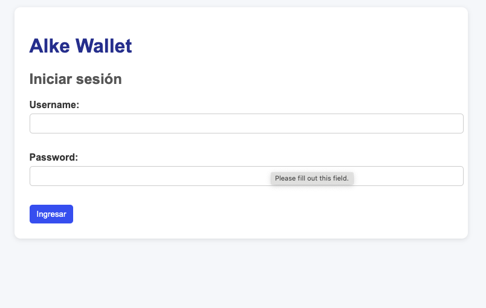
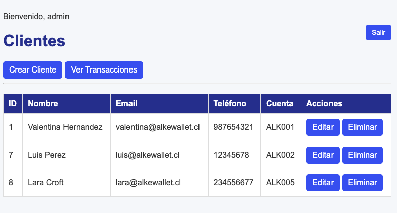
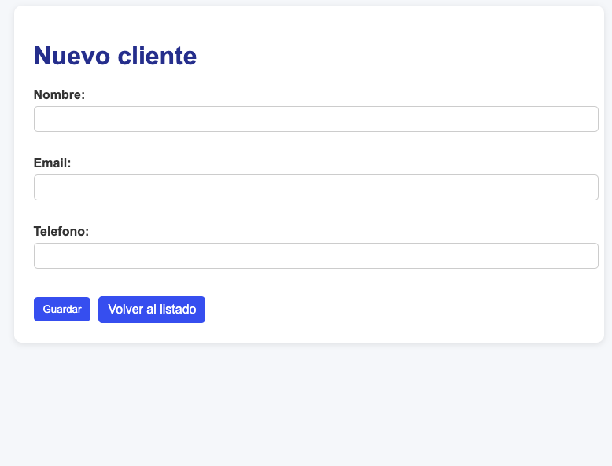
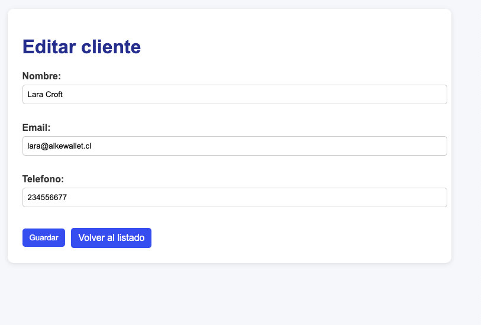
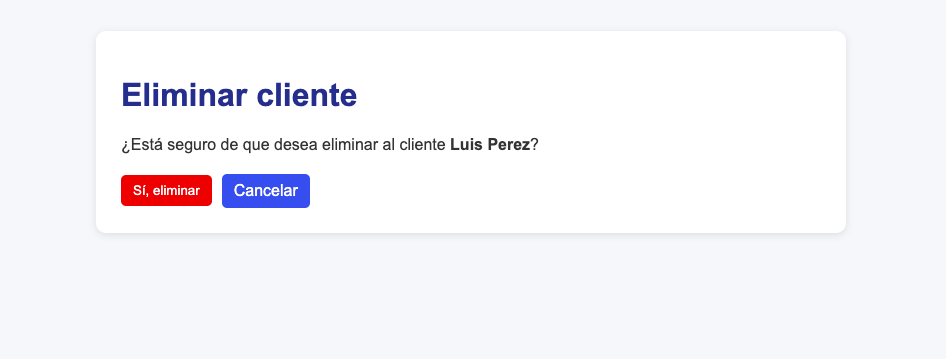
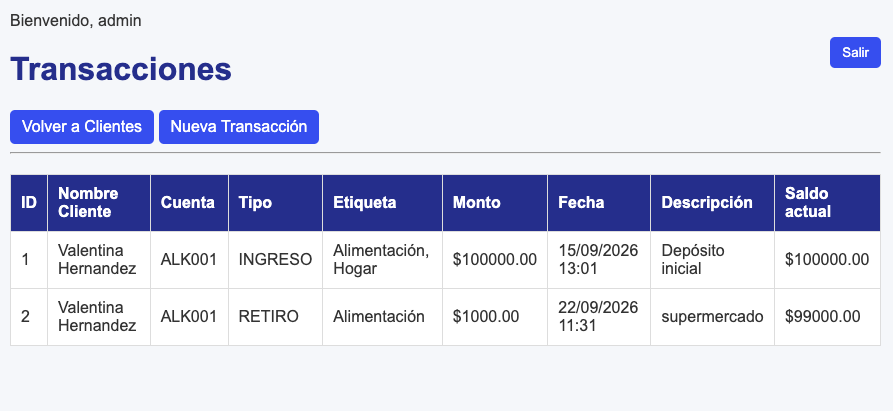
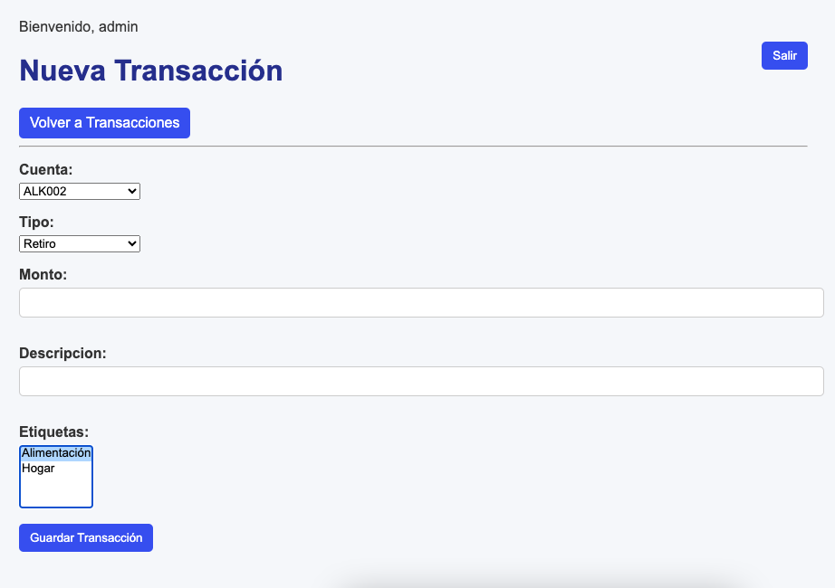
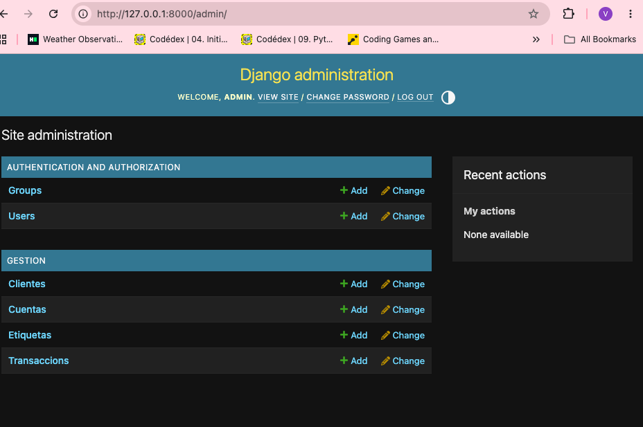

# Alke Wallet

Aplicación web desarrollada con **Django** para la gestión de una billetera digital. Permite administrar clientes, cuentas y transacciones mediante el ORM de Django, relaciones entre modelos, autenticación y panel de administración.

## Objetivo

Desarrollar una aplicación funcional para gestionar información financiera utilizando buenas prácticas de Django, incluyendo:

* Modelado de datos mediante el ORM.
* Relaciones entre entidades.
* Migraciones.
* Consultas ORM.
* Operaciones CRUD.
* Autenticación de usuarios.
* Panel de administración.
* Validaciones de datos.
* Uso de archivos estáticos (CSS).

## Tecnologías utilizadas

* Python 3.14
* Django 6.1.1
* SQLite
* HTML5
* CSS3
* Git
* Visual Studio Code

## Estructura del proyecto

```text
AlkeWallet/
│
├── gestion/
│   ├── migrations/
│   ├── static/
│   │   └── gestion/
│   │       └── style.css
│   ├── templates/
│   │   ├── gestion/
│   │   └── registration/
│   ├── admin.py
│   ├── apps.py
│   ├── models.py
│   ├── tests.py
│   ├── urls.py
│   └── views.py
│
├── websolutions_platform/
│   ├── settings.py
│   ├── urls.py
│   ├── asgi.py
│   └── wsgi.py
│
├── manage.py
├── requirements.txt
└── .gitignore
```

## Modelo de datos

El proyecto implementa cuatro modelos principales.

### Cliente

Representa a los clientes de la billetera.

* Nombre.
* Email único.
* Teléfono.

### Cuenta

Representa la cuenta asociada a cada cliente.

* Relación **OneToOne** con Cliente.
* Número de cuenta único.
* Saldo.
* Validación para evitar saldos negativos.

Al crear un nuevo cliente, se genera automáticamente una cuenta asociada con un número consecutivo, por ejemplo:

```text
ALK001
ALK002
ALK003
```

### Transacción

Representa los movimientos realizados en una cuenta.

* Relación **ForeignKey** con Cuenta.
* Tipo de transacción.
* Monto.
* Fecha.
* Descripción.
* Etiquetas asociadas.

Los tipos de transacción utilizados son:

* `INGRESO`
* `RETIRO`

### Etiqueta

Permite clasificar las transacciones.

Ejemplos:

* Alimentación.
* Hogar.
* Transporte.
* Entretenimiento.

## Relaciones implementadas

El proyecto utiliza las siguientes relaciones:

* **OneToOne:** Cliente → Cuenta.
* **ForeignKey:** Cuenta → Transacción.
* **ManyToMany:** Transacción ↔ Etiqueta.

La estructura general es:

```text
Cliente
   │
   │ OneToOne
   ▼
Cuenta
   │
   │ ForeignKey
   ▼
Transacción
   │
   │ ManyToMany
   ▼
Etiqueta
```

## Funcionalidades implementadas

### Autenticación

* Inicio de sesión.
* Cierre de sesión.
* Protección de vistas mediante `LoginRequiredMixin`.

### Gestión de clientes

* Listar clientes.
* Crear clientes.
* Editar clientes.
* Eliminar clientes.
* Visualizar la cuenta asociada.

### Gestión de cuentas

* Creación automática de una cuenta al registrar un cliente.
* Generación de números de cuenta consecutivos.
* Saldo inicial de $0.

### Gestión de transacciones

* Listar transacciones.
* Crear nuevas transacciones.
* Seleccionar la cuenta asociada.
* Registrar ingresos y retiros.
* Registrar monto y descripción.
* Asociar etiquetas a las transacciones.

### Administración

El proyecto utiliza el panel de administración de Django para gestionar los modelos registrados.

## Consultas ORM

Se trabajaron consultas utilizando el ORM de Django, incluyendo:

* `filter()`
* `exclude()`
* `annotate()`
* `raw()`

Las consultas fueron verificadas utilizando el shell de Django.

## Validaciones

Se implementaron validaciones mediante `MinValueValidator` y restricciones de los modelos.

* El saldo de una cuenta no puede ser menor que 0.
* El monto de una transacción debe ser mayor a 0.
* El email del cliente es único.
* El número de cuenta es único.

## Pruebas

Se desarrollaron pruebas automatizadas utilizando `django.test.TestCase`.

Entre las pruebas realizadas se encuentran:

| Prueba                        | Resultado  |
| ----------------------------- | ---------  |
| Crear Cliente                 | ok         |
| Relación Cliente-Cuenta       | ok         |
| Relación Cuenta-Transacción   | ok         |
| Relación Transacción-Etiqueta | ok         |
| Validación de monto           | ok         |

Resultado de ejecución:

```text
Ran 5 tests
OK
```

## Capturas del proyecto

### Login


### Listado de clientes



### Crear cliente


### Editar cliente



### Eliminar cliente


### Listado de transacciones



### Crear transacción



### Panel de administración



## Cómo ejecutar el proyecto

### 1. Clonar el repositorio

```bash
git clone https://github.com/valehd/proyecto_alkewallet.git
cd proyecto_alkewallet
```

### 2. Crear entorno virtual

Mac/Linux:

```bash
python3 -m venv venv
```

Windows:

```bash
python -m venv venv
```

### 3. Activar el entorno virtual

Mac/Linux:

```bash
source venv/bin/activate
```

Windows:

```bash
venv\Scripts\activate
```

### 4. Instalar dependencias

```bash
pip install -r requirements.txt
```

### 5. Aplicar migraciones

```bash
python manage.py migrate
```

### 6. Crear superusuario

Opcionalmente, para acceder al panel de administración:

```bash
python manage.py createsuperuser
```

### 7. Ejecutar el servidor

```bash
python manage.py runserver
```

Luego abrir en el navegador:

```text
http://127.0.0.1:8000/
```
